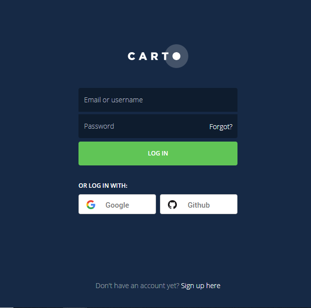
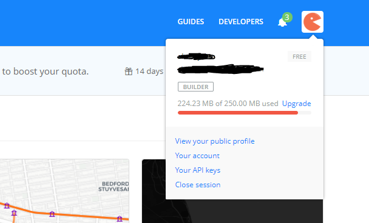
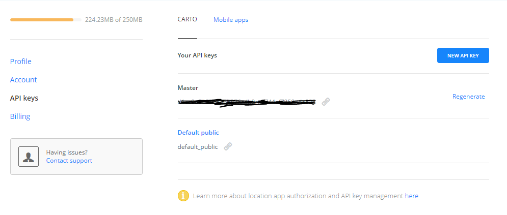

Carto
=====

CARTO (formerly CartoDB) is a Software as a Service (SaaS) cloud computing platform that provides GIS and web mapping tools for display in a web browser. The company is positioned as a Location Intelligence platform due to tools with an aptitude for data analysis and visualization that do not require previous GIS or development experience.

**API Key**

Access your API Key, which is uniquely generated for your account. When you use the CARTO Engine to request data, you can manage how your data is updated (write access), or protected, (read-only access).

Note: API Keys are only available for certain account plans.

Api Docs: https://carto.com/docs/carto-editor/your-account/#api-key

**How to get Carto Api**

* Login to Carto account
    https://carto.com/

* Now Carto Dashboard page will open, then click the icon on the top right of the page

* Then click on "Your API keys"

* Now Carto Api Page will open, Get Api key from "Master" and Create or Regenerate Api key if needed.

